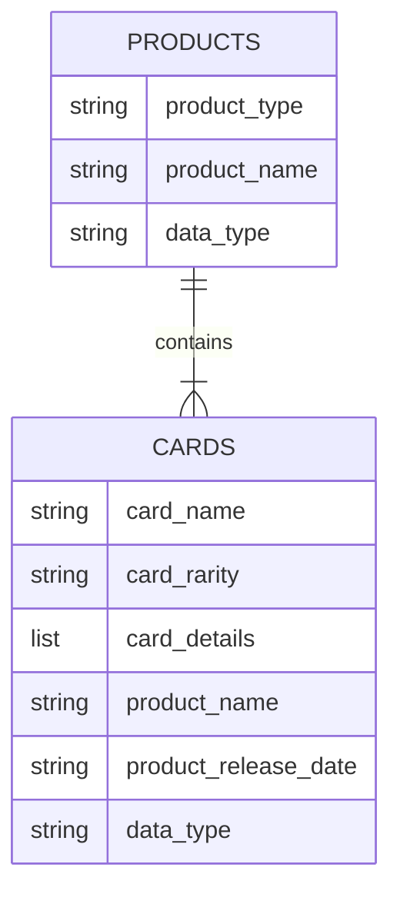

# Yu-Gi-Oh! Scraper

<p align="center">
    <a href="https://docs.python.org/release/3.11.0/"></a>
    <a href="https://github.com/albert-marrero/Yu-Gi-Oh-Scraper/blob/main/LICENSE.md"></a>
</p>

Yu-Gi-Oh! Scraper is a project that crawls websites and APIs and extracts Yu-Gi-Oh! related data from their pages.

## Sources

* [Yu-Gi-Oh! Card Database](https://www.db.yugioh-card.com/yugiohdb/?request_locale=en) (`db_yugioghcard`)

### Flowcharts

These flowcharts represent a workflow of each source of the project.

#### Yu-Gi-Oh! Card Database


### Entity Relationship Diagrams

These entity–relationship model (or ER model) describes interrelated things of interest of each source of the project.

#### Yu-Gi-Oh! Card Database



## Getting Started

These instructions will get you a copy of the project up and running on your local machine for development and testing purposes.

### Prerequisites

Requirements for the software and other tools to build, test and push

<p>
    <a href="https://black.readthedocs.io/en/stable/"></a>
    <a href="https://docs.scrapy.org/en/2.7/"></a>
</p>

### Installing

I strongly recommend that you install this project in a dedicated virtual environment to avoid conflicting with your system packages.

See [Virtual Environments and Packages](https://docs.python.org/3/tutorial/venv.html#tut-venv) on how to create and use your virtual environment.

Use the package manager [pip](https://pip.pypa.io/en/stable/) to install the requirements of this project.

```bash
python -m pip install -r requirements.txt
```

## Built With

* [Black](https://black.readthedocs.io/en/stable/) - An uncompromising Python code formatter
* [Scrapy](https://docs.scrapy.org/en/2.7/) - A fast high-level web crawling and web scraping framework

## Versioning

We use [Semantic Versioning](http://semver.org/) for versioning. For the versions
available, see the [tags on this
repository](https://github.com/albert-marrero/Yu-Gi-Oh-Scraper/tags).

## Authors

  - [**Albert Marrero**](https://github.com/albert-marrero) - *Provided Initial Code*

See also the list of
[contributors]
who participated in this project.

## Support

If you enjoy this repository, please [star](https://docs.github.com/en/get-started/exploring-projects-on-github/saving-repositories-with-stars) this repository. By starring a repository, it shows appreciation to the repository maintainer for their work. Many of GitHub's repository rankings depend on the number of stars a repository has.

## License

This project is licensed under the MIT License - see the [LICENSE.md](LICENSE.md) file for details

[contributors]: https://github.com/albert-marrero/Yu-Gi-Oh-Scraper/graphs/contributors